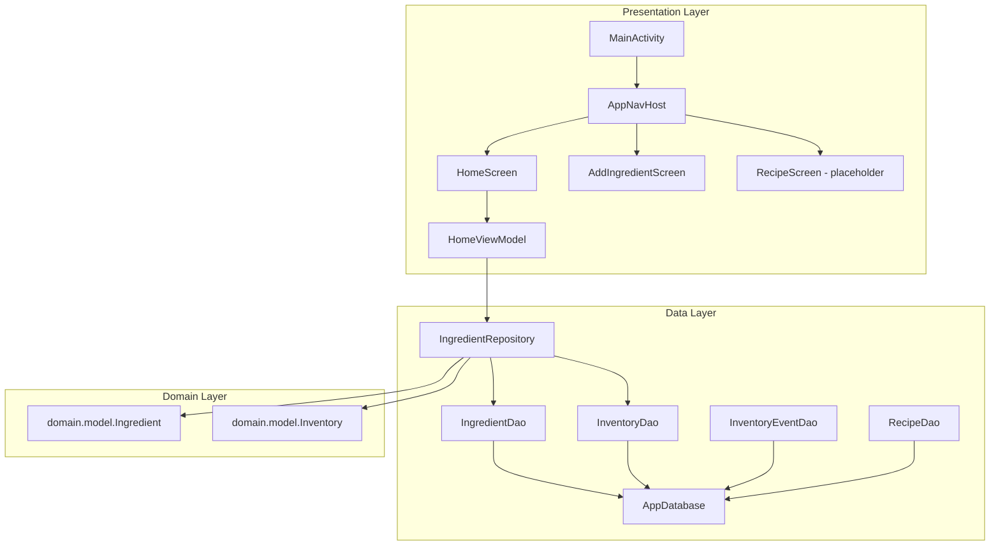

## 第一阶段目标：搭建 HomeSmartPantry 项目骨架

基于你的完整架构方案，搭建 Android 端 Clean Architecture 项目骨架，包括依赖管理、包结构、Room 数据库、导航框架和基础主题配色。

### 核心功能

1. **依赖管理**：添加 Room (KSP)、Navigation Compose、Retrofit、WorkManager、ViewModel 等核心依赖
2. **包结构**：按 Clean Architecture 创建 presentation / data / domain / sync / ocr / notification 模块
3. **Room 数据库**：创建 5 个 Entity、4 个 DAO 和 Database 类
4. **导航框架**：集成 Navigation Compose，定义路由、底部导航栏、NavHost
5. **基础 ViewModel**：创建 HomeViewModel，连接 Repository 进行数据读取
6. **MainActivity 升级**：改造为导航宿主，集成 Scaffold + BottomNavigation
7. **主题优化**：将默认紫色改为食材管理场景的墨绿+暖橙配色

### 用户原始需求表核心模块（本阶段覆盖）

- 食材管理 - 基础 Entity/DAO 层
- 操作日志 InventoryEvent - Entity 层
- 菜谱系统 Recipe/RecipeIngredient - Entity 层
- 包结构按分层（presentation / domain / data / sync / ocr / notification）

## 技术方案

### 技术栈选择

- **语言**：Kotlin
- **UI**：Jetpack Compose + Material3
- **架构**：MVVM + Clean Architecture（三层：data / domain / presentation）
- **数据库**：Room + KSP（注解处理器）
- **导航**：Navigation Compose
- **异步**：Coroutines + Flow
- **依赖管理**：Gradle Version Catalog (libs.versions.toml)
- **DI 策略**：手动依赖注入（暂不引入 Hilt/Koin）

### 关键依赖版本规划

| 依赖 | Version Catalog 名称 | 版本 | 用途 |
| --- | --- | --- | --- |
| Room Runtime | room-runtime | 2.7.1 | Room 运行时 |
| Room Ktx | room-ktx | 2.7.1 | Room + Coroutines 扩展 |
| Room Compiler (KSP) | room-compiler | 2.7.1 | KSP 注解处理器 |
| Navigation Compose | navigation-compose | 2.8.7 | 页面路由导航 |
| ViewModel Compose | viewmodel-compose | 2.8.7 | MVVM ViewModel 集成 |
| Retrofit | retrofit | 2.11.0 | 网络请求（预留） |
| Retrofit Gson | retrofit-gson | 2.11.0 | JSON 序列化（预留） |
| WorkManager | work-runtime-ktx | 2.10.0 | 后台同步（预留） |
| KSP Plugin | - | 2.2.10-1.0.31 | Kotlin 符号处理 |


### 架构图



### 包结构规划

```
com.example.homesmartpantry/
+-- MainActivity.kt                    [MODIFY] 升级为导航宿主
+-- data/
|   +-- local/
|   |   +-- entity/
|   |   |   +-- IngredientEntity.kt     [NEW] 食材定义实体
|   |   |   +-- InventoryEntity.kt      [NEW] 库存实体（含过期时间）
|   |   |   +-- InventoryEventEntity.kt [NEW] 操作日志实体（Event Sourcing）
|   |   |   +-- RecipeEntity.kt         [NEW] 菜谱实体
|   |   |   +-- RecipeIngredientEntity.kt [NEW] 菜谱-食材关联实体
|   |   +-- dao/
|   |   |   +-- IngredientDao.kt        [NEW] 食材 DAO
|   |   |   +-- InventoryDao.kt         [NEW] 库存 DAO
|   |   |   +-- InventoryEventDao.kt    [NEW] 操作日志 DAO
|   |   |   +-- RecipeDao.kt            [NEW] 菜谱 DAO
|   |   +-- AppDatabase.kt              [NEW] Room Database 定义
|   +-- repository/
|       +-- IngredientRepository.kt     [NEW] 食材仓库，封装 DAO 操作
+-- domain/
|   +-- model/
|       +-- Ingredient.kt               [NEW] 领域模型：食材
|       +-- InventoryItem.kt            [NEW] 领域模型：库存项
+-- presentation/
|   +-- navigation/
|   |   +-- NavRoutes.kt               [NEW] 路由常量定义
|   |   +-- AppNavHost.kt              [NEW] NavHost + 路由注册
|   +-- screen/
|   |   +-- home/
|   |   |   +-- HomeScreen.kt           [NEW] 食材列表主页
|   |   |   +-- HomeViewModel.kt        [NEW] 主页 ViewModel
|   |   +-- ingredient/
|   |       +-- AddIngredientScreen.kt  [NEW] 添加食材页面（占位）
|   +-- component/
|       +-- BottomNavBar.kt            [NEW] 底部导航栏组件
+-- sync/                                [预留]
+-- ocr/                                 [预留]
+-- notification/                        [预留]
+-- ui/
    +-- theme/
        +-- Color.kt                    [MODIFY] 修改为食材主题色系
        +-- Theme.kt                    [MODIFY] 更新配色方案
        +-- Type.kt                     [MODIFY] 保持默认即可
```

### 关键实施要点

1. **KSP 配置**：Kotlin 2.2.10 需配置 `id("com.google.devtools.ksp")` 插件并在 build.gradle.kts 中通过 `ksp()` 而非 `kapt()` 引用 Room 编译器
2. **Room Schema 导出**：启用 `room.schemaLocation` 便于后续版本迁移管理
3. **Flow + Room 联动**：DAO 查询返回 `Flow<List<T>>`，Repository 和 ViewModel 均使用 Flow 链，确保 UI 自动响应数据库变化
4. **手动 DI**：在 Application 级别懒加载 Database 和 Repository 实例，通过构造器参数传入 ViewModel
5. **Navigation 类型安全**：路由使用字符串常量集中管理（NavRoutes.kt），避免硬编码散落
6. **BottomNavBar 状态同步**：使用 NavController.currentBackStackEntryAsState() 同步选中状态

## 设计风格

采用清新自然的厨房生活风格，营造健康、温馨的视觉感受。

### 配色方案

- **主色**：深墨绿 (#2E7D32) - 代表新鲜食材与健康生活
- **辅色**：暖橙 (#FF8F00) - 代表烹饪温度与活力
- **背景**：暖白 (#FFF8F0) - 柔和不刺眼，营造厨房温馨感

### 页面设计（骨架阶段，2个页面+导航）

**1. HomeScreen（食材首页）**

- 顶部栏：应用标题「HomeSmartPantry」、右侧设置图标
- 搜索栏：圆角搜索框，带搜索图标（骨架阶段仅静态展示）
- 食材列表：卡片列表，每项显示食材名、数量、过期天数标签
- FAB：右下角悬浮 + 按钮，深墨绿背景色
- 底部导航：3个Tab（食材/菜谱/设置），选中态墨绿高亮

**2. AddIngredientScreen（占位页）**

- 简单的「添加食材 - 开发中」提示文字
- 顶部有返回箭头

**3. BottomNavBar**

- 食材 Tab：冰箱图标
- 菜谱 Tab：菜谱图标
- 设置 Tab：齿轮图标
- 选中态主色高亮，未选中灰色

### 布局特点

- Material3 卡片组件，圆角 12dp
- 列表项内边距 16dp，间距 8dp
- Scaffold 整体架构，顶部栏+底部导航+FAB

# Agent Extensions

本阶段为纯 Android 客户端项目骨架搭建，不涉及浏览器自动化、文档生成、多媒体生成等需求，无需使用 Agent Extensions。